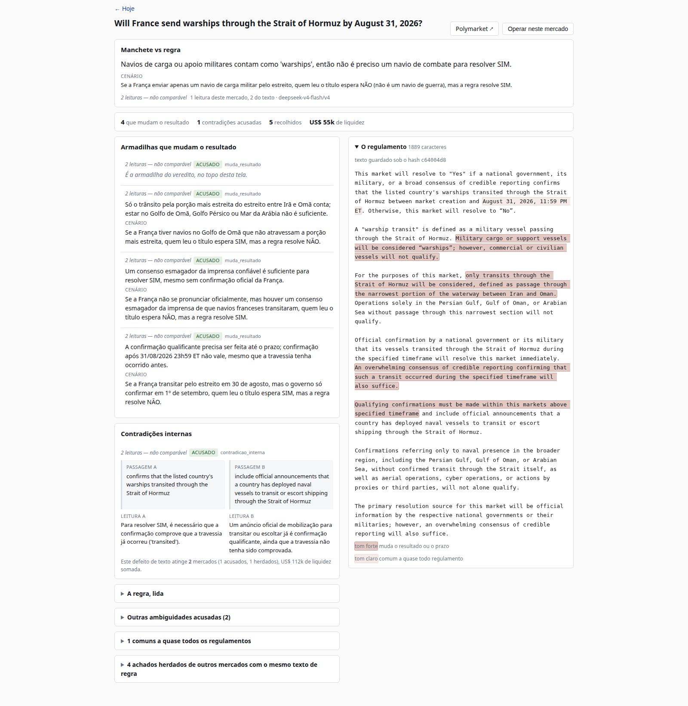

# Prediction Radar

A research system that watches a roster of Polymarket markets, reads the
resolution rules most traders skip, and shows a human where the headline and the
rule disagree. It finds and records; it decides nothing.

It arrived here by measuring. Three months and eight hypotheses went into asking
whether an LLM agent could out-forecast a prediction market. All eight closed
negative, and the record is kept: [`docs/research-record.md`](docs/research-record.md).

**Status** — collection and rule reading are running in production. **1,021**
markets in the roster across 7 subjects; **1,033** markets digested into
**267** distinct rule texts; **78.1%** of them carry a `veredito`. The weekly
human judgement loop is next.

*Roster and digestion measured 24/08/2026; `veredito` coverage 22/08/2026.*



*The rule screen, 24/08/2026 — the headline asks about warships, the rule counts
cargo ships. What it shows and why is in [The rule screen](#the-rule-screen).*

---

## The thesis

Prediction markets publish a probability for every event. That number is a strong
baseline — aggregated, incentive-aligned, continuously updated. There are only
two ways past it: **find information the market prices poorly**, or **run a
computation nobody bothers to run**.

Eight hypotheses went down the first road — better forecasts, from better
information — and all eight closed negative. This project took the second road:

> **The market prices the HEADLINE. The market resolves on the RULE. The gap
> between the two is the opening.**

This is a different kind of task. It does not require out-forecasting anyone; it
requires reading the resolution criteria that most traders skip. Measured: the
`description` field is populated in **100%** of markets, median **1,262
characters** of conditions, void clauses, named sources and tie-breaks.

Knowing that "City won three matches" is not "City won the league" is not a
forecast. It is reading.

A worked example, from the screenshot above. The headline asks whether France
will send **warships** through the Strait of Hormuz. The rule says military cargo
and support vessels count as warships — so a supply ship resolves the market YES
while the headline still reads as a combat deployment. Nobody has to predict
anything for that gap to be worth money.

---

## How it works

Four stages, each on its own cadence, each writing to Postgres and reading
nothing from the stage after it.

```
selection ──► collector ──► digestion ──► views ──► rule screen ──► a human judges
   6h          15 min        on demand      SQL        the web app       weekly
                                                            │
                                                            └──► eval: my Brier vs the market's
```

**selection** — recomputes the roster every 6h from a rule, not from a fixed
list. A new market that passes gets in; a market that resolves drops out. Today:
1,021 active markets across 7 subjects (`brasil`, `ia-e-tecnologia`,
`macro-e-mercados`, `saude-e-pandemias`, `eleicoes-e-politica`,
`esporte-de-temporada`, `geopolitica-e-conflitos`), measured 24/08/2026.

**collector** — a price snapshot every 15 minutes: `best_bid`, `best_ask`,
`mid_price`, `spread`, `bid_depth`, `ask_depth`. Fifteen minutes because a
reaction that decays in 3h yields 12 points; hourly would yield 3, and a jump
between two snapshots leaves no trace at all.

**digestion** — an LLM reads each market's rule text several times and records
what it found: traps, ambiguities, contradictions, each quoting the exact
`trecho` it came from. The rule text is stored under its own `sha256`, which is
what makes the readings survive Polymarket editing a description — and what
collapses 1,033 markets into 267 distinct texts, because sibling markets share
one rule. A finding on a shared text is `herdado` by every market that shares it.

**views** — where all the opinion lives. Price band, minimum volume, rule size,
grouping by subject: all `where` clauses, swappable in seconds. Nothing about
what counts as interesting is compiled into the collectors.

**eval** — the machine that measured the agent, pointed at the human instead. It
does not care whether the forecast came from a model or a person.

Still running from the older system: heartbeat, health alerting, the Telegram
bot. Deliberately off: the analyst, every enricher, esports collection, the
resolver, the generic detectors.

---

## Glossary

The domain nouns stay in Portuguese. Each one is also a database column and a
word in the spec that defines it, and translating a single link breaks a chain
that runs unbroken from spec to screen to `select`.

| term | meaning |
| --- | --- |
| `regra` | the market's rule text, the thing that decides resolution |
| `manchete` | the market's title, the thing the price reacts to |
| `leitura` | one reading of a `regra` by the model; the same text is read several times |
| `achado` | one defect found in a `regra` |
| `pegadinha` | a trap; the worst kind changes who wins (`muda_resultado`) |
| `ambiguidade` | the rule can be read two ways |
| `contradicao` | two passages of the rule disagree |
| `trecho` | the exact words quoted from the rule; never translated, never rewritten |
| `acusado` | the model read THIS market and found it |
| `herdado` | the model read a sibling market with the same rule text |
| `veredito` | the headline-versus-rule statement at the top of the screen |

---

## The rule screen

[The screenshot at the top of this file](#prediction-radar) is this screen. Its
interface chrome is still hardcoded in Portuguese — that is issue #10, the last
open acceptance criterion here.

One market, one screen, ordered by the question it exists to answer. Seven
decisions shape it, and every threshold below is measured, dated, and carries the
command that recomputes it.

**A `veredito` opens the screen.** It states what the title makes a reader
believe and what the rule actually demands. Nothing new is generated: the
strongest accused `muda_resultado` trap already contains exactly that sentence,
so this is selection, not generation. It covers **78.1%** of markets (807 of
1,033, measured 22/08/2026); the rest get an empty state that says so.

**The rule text sits in a right-hand column, and each `trecho` is highlighted
inside it.** A quotation out of context is precisely how a headline deceives, so
showing the clause where it lives is the antidote. The column is sticky, so
scrolling the traps never takes the rule out of view.

**Repeated findings merge.** The same defect quoted at three different lengths
was three rows. Absorption by the longest containing span makes it one, and the
merged agreement count is the union of the readings that found it — not the sum,
which inflates. The merge cuts **45.3%** of findings corpus-wide but only
**7.0%** of what the visible sections show, because it lands almost entirely
inside the collapsed block.

**Passages common to nearly every Polymarket rule collapse.** `11:59 PM ET`
appears in **47.2%** of rule texts. It is house style, not a property of this
market. Such findings move to a closed block and carry the frequency that put
them there, with its denominator. The cut is **20%**, the middle of a measured
gap: three pairs sit above 30% and the fourth drops to 9.7%, with nothing in
between across 22.1 points. The spec guessed 80% before measuring, which would
have collapsed nothing.

**`herdado` findings collapse, and the mechanism is explained once.** The
paragraph explaining what an inherited finding is used to appear once per item —
ten times on one screen in the worst case.

**Empty sections say which kind of empty they are.** "Read and clean" is
different information from "not read", and "none accused, four inherited below"
is different from both. A section never simply disappears: an absent section
reads as "nobody looked at this".

**The trap section shows 5 items** before `ver mais N` ("show N more"): median 3 and p90 6
accused traps per market, so the button fires in **10.6%** of markets.

Navigation follows the flow rather than offering parallel destinations. You list,
you pick a market, and only then you decide whether to bet — so the market
travels in the route, and `{ tela: 'operar' }` with no market is not a state that
can be written down.

---

## Point-in-time correctness

A backtest that can see the future is worse than no backtest, because it produces
confident numbers that are wrong. Four mechanisms defend against it:

**`as_of` and `observed_at` are different columns.** When a fact was true is not
when we learned it. Replay filters on `observed_at`, never `as_of`.

**`observed_at` is not forgeable.** A `BEFORE INSERT` trigger stamps it with the
server clock, overwriting whatever the client sends. The residual error has a
known direction and it is the harmless one: replay considers *less* than we knew.

**The context store is append-only, enforced by the database.** The same trigger
raises on `UPDATE` — which catches `UPSERT` too, the most likely way the mistake
gets in unnoticed.

**Rule text is stored under its own hash, not by reference.** Polymarket can edit
a description at any time. Storing the text the readings were actually made
against is what keeps a `leitura` interpretable after that happens, and what lets
a `trecho` still be located inside the text it was quoted from.

Each source declares `supportsPointInTime`. Sources that cannot honestly claim it
are refused in replay — both when the caller asks, and when `asOf` is in the past
even if nobody asked. That second guard is the one that protects against
forgetting.

---

## Running it

Node with TypeScript through `tsx`. There is no build step: every entry point is
a `.ts` file run directly.

```sh
npm install
cp .env.example .env    # Supabase URL and service key, LLM provider key
```

The jobs, each idempotent and safe to run by hand:

```sh
npm start               # the scheduler: selection, collection, retention, health
npm run radar:lista     # recompute the roster now
npm run radar:coletor   # take one price snapshot now
npm run digerir         # read rule texts with the model
npm run carregar-digest # load the readings into the digest tables
npm run bot             # the Telegram bot
```

The web app is a separate package with its own dependencies:

```sh
cd web && npm install && npm run dev   # http://localhost:5173
```

The screen has no credentials of its own. Supabase refuses a service key sent
from a browser, and the radar views are revoked from `anon`, so the Vite dev
server proxies `/sb` to PostgREST and swaps the headers server-side. The service
key never enters the bundle.

That proxy authenticates nobody. It attaches the service key to whatever reaches
it, and `service_role` bypasses RLS — so anyone who reaches the dev server
reaches the whole database. Listening on localhost is the only thing making it
safe: never start it with `--host`, and never put it anywhere exposed.

Every threshold quoted in this README came from a measurement script, and the
ones behind a decision write a dated report into `probes/` rather than printing
and vanishing — `npm run medir:tela-regra` and `medir:digest-nulo` do;
`medir:idioma` and `medir:texto-perdido` print to stdout.

Migrations are written but never applied by the tooling: `supabase migration new`
produces the `.sql`, and applying it is a human decision. There are 47 of them.

---

## Tests

```sh
npm test        # everything that runs without a database
npm run test:db # the same suite, with a local Postgres for the tests that need one
```

**987 tests, 986 passing, 1 skipped, 30 suites, 8.8s** — measured 24/08/2026 with
`npm test`, which is the whole suite and needs nothing installed. The one skip is
the test that requires a database, and it states why it skipped.

`npm run test:db` starts a local Supabase stack — Postgres, PostgREST and the
gateway, with the schema built from `supabase/migrations` so it cannot drift from
production — and then runs the suite with `RADAR_TEST_DB=required`, which turns a
missing database into a failure instead of a skip. Stop it with
`npm run test:db:stop`.

Measured 23/08/2026, images already pulled: **32s** from nothing — empty volumes,
every migration replayed, whole suite run — and **5s** with the stack already up.
The first run ever also downloads about 2 GB of container images.

Why a real Postgres and not a fake: some defects are the database exercising a
freedom no mock has. The one under test is pagination by `OFFSET` under a
non-total order, where equal-keyed rows shift between pages and the reader
silently sees one twice and another never. Two substitutes were tried and
rejected in `f755843` — spying on the query builder, and simulating PostgREST —
because both only assert that the code calls what it already calls. The
reproduction and the measured thresholds are in `web/src/lib/dados.db.test.ts`.

The test database is never this project's Supabase instance: every client goes
through a guard that refuses any host that is not this machine. Point it
elsewhere with `TEST_SUPABASE_URL` and the run aborts rather than writing.

**A test that asserts only the final value does not prove the transition.** When
the path to a value has more than one step, another rule along the path usually
produces that same value at the end, and the assertion passes without ever
reaching the rule it existed to pin down. The pure modules behind the rule screen
are verified by mutation on every axis they claim to protect: each mutation is
applied to the real file, the suite is run, and the file restored.

---

## Design principles

Six rules, each learned by breaking something.

**1. Filter at collection only what does not change; filter in the view what
does.** Category doesn't change → belongs in collection. Price changes → does
not, because filtering by price drops a market from the roster *exactly when it
moves*, which is the event being studied.

**2. `radar_tracked` is a protection mark and only grows.** Never unmark. A
market leaves the roster *because it resolved* — and unmarking hands its series
to the retention job's `finalized` branch, which deletes without an age
condition, at the moment the outcome makes the data valuable. This is why the
mark stands at 1,201 while the active roster is 1,021: the 180 resolved markets
keep their history.

**3. Subject is a column, not a filter.** 22 markets about Iran are 22
opportunities to trade and **one observation** when measuring. Clustering belongs
to the measurement.

**4. `mid_price` is NULL when a side of the book is missing.** Never 0.50, never
the single side repeated. An empty book has a mid of 0.50 by arithmetic, and that
fabricated a +0.13 gap that did not exist.

**5. Ceilings come from measurement, not invention.** The API is not the
bottleneck — calls are batched, a thousand markets cost ~1.3k calls/day on a free
endpoint. Disk is.

**6. Deleted code is in git; deleted data is gone.** Delete code freely. Never
delete data.

---

## The research record

Before the current thesis, the project spent three months asking whether an LLM
agent could out-forecast the price. Eight hypotheses, each with a death criterion
declared before the measurement. All eight closed negative:

> **Where this market has size, it is efficient. Where it is inefficient, it has
> no size.**

The headline number: at n = 167 scorable forecasts, the agent's Brier was 0.1762
against the market's 0.1712 — a skill of **−0.029**. A later prompt version
reached parity on a harder sample, which is not the same as edge.

The full record — all eight hypotheses with the number that killed each, the
calibration results, and ten infrastructure findings that were not what they
looked like — is in [`docs/research-record.md`](docs/research-record.md). It is
kept rather than deleted, because a closed door is only useful if the reason it
closed can be checked.

---

## Stack and current state

TypeScript on Node (ESM, no build step), Supabase/Postgres, Railway, Telegram,
React and Vite for the screen. Data from the Polymarket Gamma and CLOB APIs. LLM
calls go through a thin provider interface, so the model is a config value rather
than a code dependency.

**Running:** selection, collection, digestion, retention, health monitoring, the
Telegram bot, the rule screen.

**Off, deliberately:** the analyst and every enricher (measured negative), esports
collection (no consumer), the generic detectors.

**Next:** accumulate two months of series, judge weekly, then run the eval with a
human forecaster in place of the agent. Two prerequisites are open and tracked:
the list-to-decision stopwatch is not yet persisted, so no series of it exists
(#3), and there is still no retention rule, so work is spent on markets that
already have an outcome (#4, #5).

The question this answers is the one the project has been circling since the
start — *is there edge here, and is it mine or the market's?*

This is a personal research project, built solo, as the practical component of a
postgraduate program in applied AI engineering. It has no users, no revenue, and
no product. Its output is measurements, including the ones that closed doors.

---

## License

Code: MIT. Market data belongs to its respective sources and is subject to their
terms.

Nothing here is financial advice. Prediction markets are regulated differently
across jurisdictions and are restricted or prohibited in some, including Brazil.
